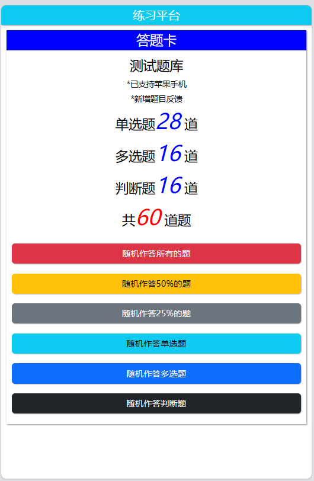
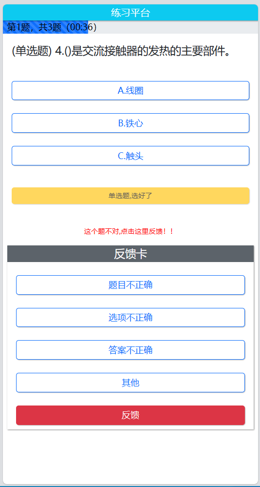
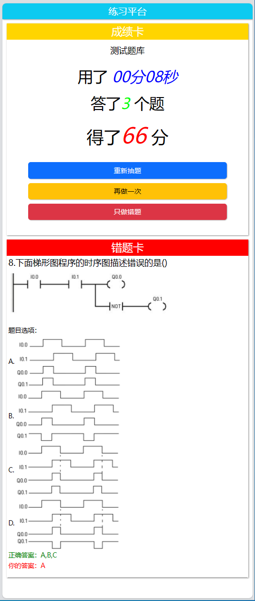
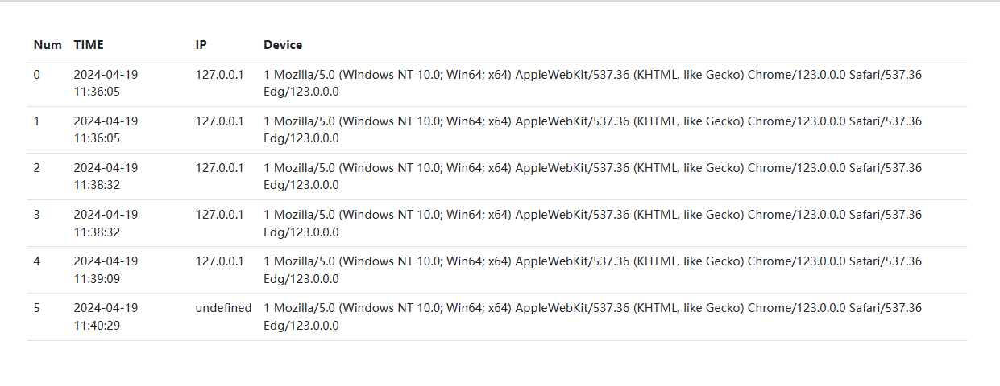
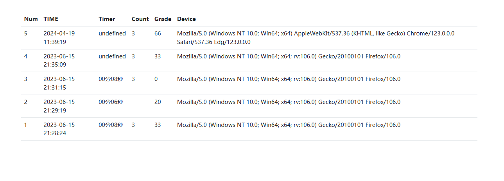
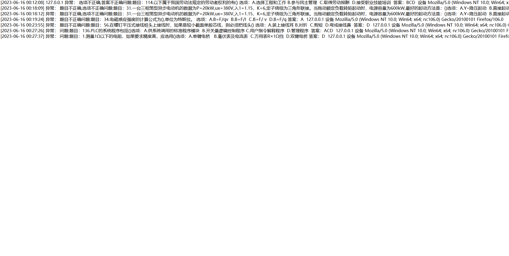

# 基于Bootstrap线上刷题平台




### 题目支持

| 单选题 | 多选题 | 判断题 |
| :----: | :----: | :----: |
|  支持  |  支持  |  支持  |


### 功能支持

| 错题卡 | 答案提示 | 图片题目与选项 | 题目反馈 | IP记录 | 成绩记录 |
| :----: | :------: | :------------: | :------: | :----: | :------: |
|  支持  |   支持   |      支持      |   支持   |  支持  |   支持   |


### 目录结构

```apl
│  .htaccess - Apache配置文件
│  favicon.ico - 网站图标
│  feedback.txt - 题目反馈表
│  grade.html - 历史成绩页面
│  grade.txt - 历史成绩表
│  index.php - 网站
│  ip.html  - IP记录绩页面
│  ip.txt  - IP记录绩表
│  nginx.htaccess - Nginx配置文件
│  readme.md - 文档
├─Bootstrap - Bootstrap 框架
├─html - 源码
│  │  feedback.php - 反馈
│  │  grade.php - 成绩记录
│  │  index.php - 主要页面
│  ├─css
│  │      index.css - 样式表
│  ├─img
│  │      t130.png - 题目图片
│  │      t130_A.png - 题目图片
│  ├─js
│  │      index.js - 主脚本
│  │      QuestionBankParse.js  - 题库解析脚本
│  └─txt
│          QuestionBank.txt - 题库
└─png - 文档图片


```


### 题目格式

- 题库存放位置：html/txt/QuestionBank.txt

##### 普通题目

- 题目：xxxx 选项：A.xx B.xx C.xx D.xx 答案：D
- 例如：题目：1.测量1Ω以下的电阻，如果要求精度高，应选用()选项： A.万用表R×1Ω挡 B.毫伏表及电流表 C.单臂电桥  D.双臂电桥 答案：D

##### 图片题目

- 题目：xxxx[img/xxx]  选项： A.[img/xxx] B.[img/xxx] C.[img/xxx] D.[img/xxx] 答案：D
- 例如：题目：8.下面梯形图程序的时序图描述错误的是()[img/t130] 选项： A.[img/t130_A] B.[img/t130_B] C.   [img/t130_C] D.[img/t130_D] 答案：BCD
- 注意图片只支持png格式
- 图片存放位置：html/img

### IP页面

#### 访问地址

```apl
IP或域名/ip.html
```

#### 格式
| 序号  | 时间 | IP地址 | 设备 |
| ---- | ---- | ---- | ------ |
| Num  | TIME | IP   | Device |

### IP页面

#### 访问地址

```apl
IP或域名/ip.html
```

#### 格式
| 序号  | 时间 | 答题所用时间 | 题目 | 成绩 | 设备 |
| ---- | ---- | ---- | ------ | ------ | ------ |
| Num  | TIME | Timer | Count | Grade | Device |


### 题目反馈记录(非页面)

#### 访问位置

```apl
网站根目录/feedback.txt
```

#### 格式
| 时间 | 异常       | 题目 | 答案 | IP地址 | 设备 |
| ---- | ---- | ------ | ------ | ------ | ------ |
| [2023-06-16 00:27:37] | 题目不正确 | 56.在螺钉平压式接线桩头上接线时，如果是较小截面单股芯线...... | D | 127.0.0.1 | Mozilla/5.0 (Windows NT...... |

### 页面

#### 主页面


#### 答题页



#### 结束答题页



#### IP记录页



#### IP成绩页



#### 题目反馈记录(非页面)



### 开源协议

```c++
/**
 * Copyright 2023-2024 AhDun. All rights reserved.
 * 
 * Licensed under the Apache License, Version 2.0 (the "License");
 * you may not use this file except in compliance with the License.
 * You may obtain a copy of the License at
 * 
 *     http://www.apache.org/licenses/LICENSE-2.0
 * 
 * Unless required by applicable law or agreed to in writing, software
 * distributed under the License is distributed on an "AS IS" BASIS,
 * WITHOUT WARRANTIES OR CONDITIONS OF ANY KIND, either express or implied.
 * See the License for the specific language governing permissions and
 * limitations under the License.
 *
 */
```

